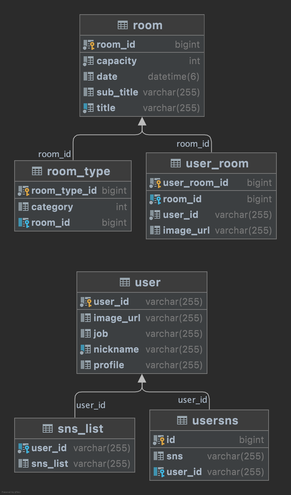

# pepple_back

### 사용 스택

##### Java 11
##### MySQL 8
##### Spring Data JPA
##### JWT
##### Spring Security

### 1. 실행방법

#### application.yml 파일 추가

```yml
spring:
  datasource:
    driver-class-name: com.mysql.cj.jdbc.Driver
    url: your database
#    username: root
    hikari:
      username: user
      password: password
  jpa:
    show-sql: true
    generate-ddl: true
    hibernate:
      ddl-auto: update
    database: mysql
    database-platform: org.hibernate.dialect.MySQL8Dialect
  security:
    oauth2:
      client:
        registration:
          google:
            clientId: id
            clientSecret: secret
            redirectUri: "{baseUrl}/oauth2/callback/{registrationId}"
            scope:
              - email
              - profile
          github:
            clientId: id
            clientSecret: secret
            redirectUri: "{baseUrl}/oauth2/callback/{registrationId}"
            scope:
              - user:email
              - read:user
          kakao:
            clientId: id
            clientSecret: secret
            redirectUri: "{baseUrl}/oauth2/callback/{registrationId}"
            authorizationGrantType: "authorization_code"
            scope:
              - profile_image
              - profile_nickname
            client-authentication-method: POST
        provider:
          kakao:
            authorizationUri: "https://kauth.kakao.com/oauth/authorize"
            tokenUri: "https://kauth.kakao.com/oauth/token"
            userInfoUri: "https://kapi.kakao.com/v2/user/me"
            clientInfo: "Kakao"
            userNameAttribute: "id"

# Jwt 설정
jwt:
  secret_key: "1234"

#Agora 설정
agora:
  appId: yourAppId
  appCertificate: yourCertificate

```

Oauth2를 사용하기 위해 kakao, google, github에서 

clientId와 secretkey를 받고, redirectUrl을 등록해줍니다.

agora api에서 제공하는 appId 및 certificate를 입력해줍니다.

jwt 생성시, 사용할 secret_key를 입력해줍니다.


#### 2. 실행

> ./gradlew bootRun

#### 3. DB 구성



#### 4. API 명세

> https://pepple.social/swagger-ui.html
> 
> 혹은
> 실행 후 http://localhost:8080/swagger-ui.html

#### 5. 프로젝트 관련 내용

> https://www.notion.so/Project-Pepple-7fcbf17c56e4455fac90c6999815c08c
